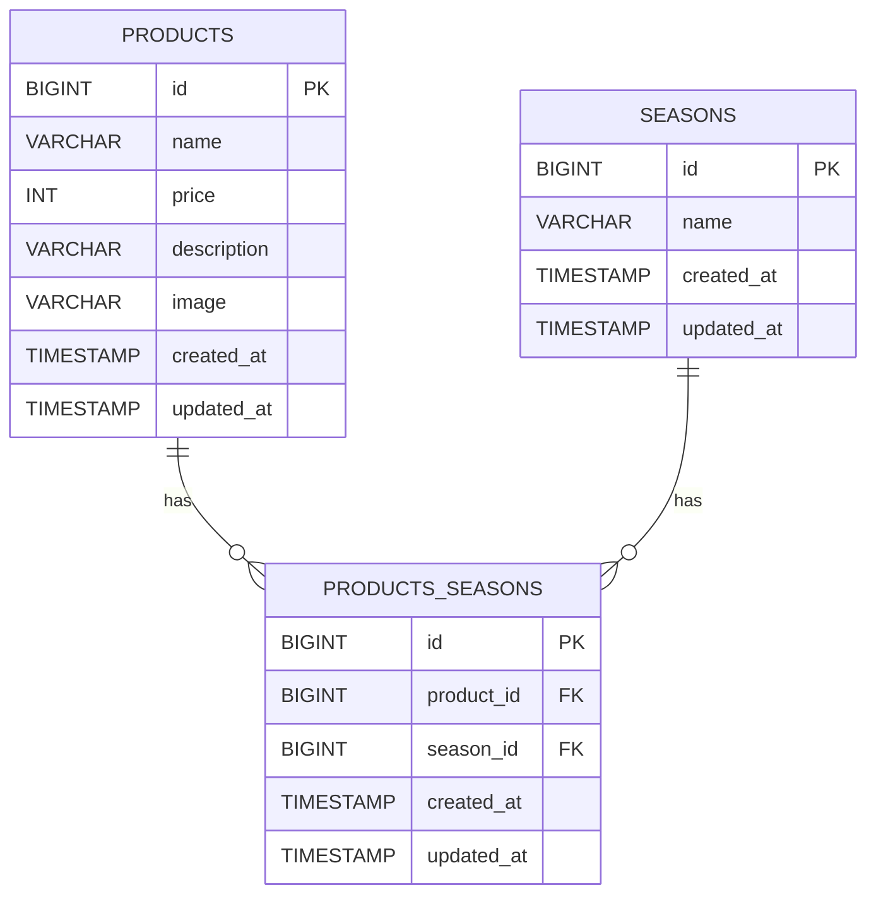

# アプリケーション名
Fresh（もぎたてフリマサイト）

## 概要
本アプリケーションは、フルーツ商品の登録・検索・詳細表示・更新・削除機能を持つシステムです。  
商品ごとに「季節」を複数紐づける中間テーブルを用いて、多対多（Many-to-Many）リレーションを実装しています。  
また、画像アップロードやバリデーション、シンボリックリンクを用いた画像保存も実装しました。


## 環境構築

### Docker ビルド
```bash
git clone https://github.com/nayu1011/Fresh.git
docker compose up -d --build
```

＊MySQLは、OSによって起動しない場合があるのでそれぞれのPCに合わせてdocker-compose.ymlファイルを編集してください。

### Laravel環境構築
```bash
docker compose exec php bash
cp .env.example .env
composer install
php artisan key:generate
php artisan migrate --seed
php artisan storage:link
exit
```

## 使用技術(実行環境)
php 8.1
Laravel  8.83.29
MySQL 8.0.26
nginx 1.21.1

## ER図


## テーブル仕様書
### products テーブル

| カラム名 | 型 | NULL | デフォルト | 備考 |
|-----------|----|------|------------|------|
| id | BIGINT | NOT NULL | AUTO_INCREMENT | 主キー |
| name | VARCHAR(255) | NOT NULL |  | 商品名 |
| price | INT | NOT NULL |  | 値段（0〜10000円） |
| description | VARCHAR(120) | NOT NULL |  | 商品説明（120文字以内） |
| image | VARCHAR(255) | NOT NULL |  | 商品画像パス（例：img/kiwi.png） |
| created_at | TIMESTAMP | NULL | CURRENT_TIMESTAMP | 登録日時 |
| updated_at | TIMESTAMP | NULL | CURRENT_TIMESTAMP | 更新日時 |

---

### seasons テーブル

| カラム名 | 型 | NULL | デフォルト | 備考 |
|-----------|----|------|------------|------|
| id | BIGINT | NOT NULL | AUTO_INCREMENT | 主キー |
| name | VARCHAR(50) | NOT NULL |  | 季節名（春・夏・秋・冬） |
| created_at | TIMESTAMP | NULL | CURRENT_TIMESTAMP | 登録日時 |
| updated_at | TIMESTAMP | NULL | CURRENT_TIMESTAMP | 更新日時 |

---

### products_seasons テーブル（中間テーブル）

| カラム名 | 型 | NULL | デフォルト | 備考 |
|-----------|----|------|------------|------|
| id | BIGINT | NOT NULL | AUTO_INCREMENT | 主キー |
| product_id | BIGINT | NOT NULL |  | 外部キー（products.id） |
| season_id | BIGINT | NOT NULL |  | 外部キー（seasons.id） |
| created_at | TIMESTAMP | NULL | CURRENT_TIMESTAMP | 登録日時 |
| updated_at | TIMESTAMP | NULL | CURRENT_TIMESTAMP | 更新日時 |


## URL
開発環境：http://localhost/products  
phpMyAdmin：http://localhost:8080/